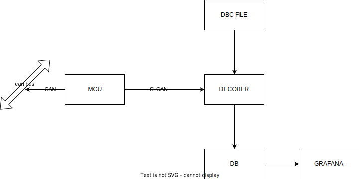
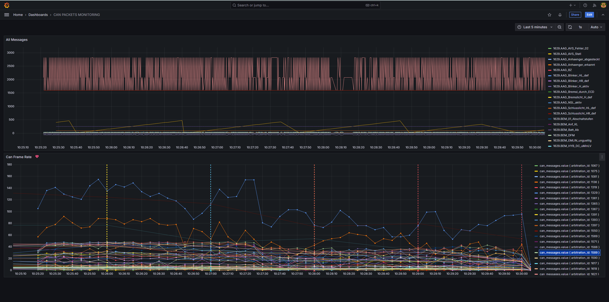

# CAN Bus Data Acquisition and Visualization for Audi A3 8P (2005)

This project demonstrates a system for acquiring and visualizing CAN bus data from an Audi A3 8P (2005) using an STM32L46RG microcontroller, an MCP2515 CAN controller, and Grafana.

## Overview

The system comprises the following components:

1. **Embedded Application (STM32L46RG & MCP2515):**  An embedded application running on the STM32L46RG interfaces with the MCP2515 CAN controller.  This application reads CAN bus data from the vehicle's network (specifically, tapped into the bus behind the car radio, operating at 100kbps). The data is then transmitted over a serial connection using the [SLCAN protocol](https://github.com/linux-can/can-utils/blob/master/slcand.c).

2. **CAN to Serial Bridge (SLCAN):** The SLCAN protocol facilitates communication between the embedded system and a Linux host computer.  The `slcand` utility is used to create a virtual CAN interface (`can0`) on the host, bridging the serial port to the software.

3. **Data Decoder (Python & cantools):** A Python script utilizes the `cantools` library to decode the raw CAN data received on the virtual CAN interface (`can0`).  This script uses a DBC file (obtained from [OpenDBC](https://github.com/commaai/opendbc)) specific to the Audi A3 8P (2005) to interpret the raw data into meaningful signals.

4. **Data Storage (InfluxDB):** The decoded CAN data is stored in an influxDB database for long-term retention and analysis.
5. **Visualization & Monitoring (Grafana):** Grafana, a powerful visualization platform, is used to display and monitor the decoded CAN data in real-time, providing insights into the vehicle's various systems.


## Architecture



## Setup and Installation
Two main components need to be set up: the embedded application and the data decoder.

Check detailed specific setup instructions:
- [Embedded Application](docs/RustEmbeddedApplication.md)
- [Data Decoder](docs/Decoder.md)

### Hardware

1. Connect the MCP2515 CAN controller to the STM32L46RG.
2. Tap into the CAN bus behind the car radio (ensure proper safety precautions are taken when working with the vehicle's electrical system).
3. Connect the STM32L46RG to the Linux host computer via USB-Serial.

### Software

1. **Embedded Application:** Flash the compiled embedded firmware to the STM32L46RG.
    ```bash
    cargo run --release --bin can_sniffer
    ```
2. **SLCAN Bridge:** Run the `slcan_setup.sh` script on the Linux host to configure the serial port and create the virtual CAN interface (`can0`).
3. **Python Dependencies:** Install the necessary Python libraries: `pip install cantools pyserial pandas numpy sqlite3`.
4. **Database:** InfluxDb is used as a time-series database to store the decoded CAN data. Run the `docker compose up` command to start the InfluxDb container
5. **Grafana:** Deploy Grafana using the provided `docker-compose.yaml` file. Configure a data source to connect to the InfluxDb database. Create dashboards to visualize the desired CAN signals.
6. **Data Decoder:** Run the `can_analyze.py` script to decode the CAN data, store it in the database, and enable Grafana to visualize it.

## Basic Usage

1. Tap into can bus behind the car radio and power on the vehicle.
2. Run the `docker compose up` command to start Grafana and InfluxDb
2. Run the `slcan_setup.sh prod` script to establish the CAN to Serial bridge.
3. Run the `can_analyze.py can0` script to begin decoding and storing CAN data.
4. Open Grafana in your web browser to monitor the decoded CAN data.




## Testing

1. Run the `sclan_setup.sh test` script to establish the CAN to Serial bridge.
2. Run the `can_analyze.py` script to begin decoding and storing CAN data. Default socket is `vcan0`.
3. Open Grafana in your web browser to monitor the decoded CAN data.


## Future Improvements

* Implement error handling and logging in the embedded application.
* Develop a more robust and user-friendly interface for interacting with the system.
* Explore additional visualization options within Grafana.
* Implement the event handler logic to trigger actions based on specific CAN data patterns.


## Disclaimer

This project is for educational and experimental purposes only.  Use caution when working with a vehicle's CAN bus, as improper modifications can have unintended consequences.  Always consult the vehicle's documentation and seek professional assistance if needed. 